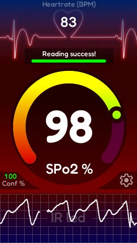

# EVE-MCU-Dev Pulse Oximeter Example

[Back](../README.md)

## Pulse Oximeter Example

**This demo is targeted specifically for the [IDM2040-43A](https://brtchip.com/product/idm2040-43a/) develoepment module.**

The `Pulse Oximeter` example demonstrates the integration of a [SparkFun Pulse Oximeter and Heart Rate Sensor](https://www.sparkfun.com/sparkfun-pulse-oximeter-and-heart-rate-sensor-max30101-max32664-qwiic.html) into a IDM2040-43A based application, drawing a dynamic UI to visulaise sensor readings on screen. The IDM2040-43A combines a [BT883](https://brtchip.com/product/bt883/) Embedded Video Engine, 4.3" capactive touch display, Raspbberry Pi RP2040 MCU, and a variety of I/O connections, making it ideal for prototyping and final applications. 

A pulse oximieter display is drawn using custom bitmaps, blending, custom arc & line graph widgets, and custom fonts. Data to update the display readouts is provided by the readings from the atrtached `SparkFun Pulse Oximeter and Heart Rate Sensor`. A library implementation to read the sensor values over I2C is provided in the [/sensor](sensor) folder, and is based upon the [Sparkffun Library](https://github.com/sparkfun/SparkFun_Pulse_Oximeter_Heart_Rate_Sensor)

The `Pulse Oximeter` code uses the `furman` snippet from the [snippets](eve_library/examples/snippets) directory to calculate angles using furman trigonometry. Furman angles are an implementation of angles using only integer values to enable this demo to run on hardware which does not support floating point values. Refer to the BridgeTek Programming Guides for the EVE device for a full explanation of this method.


Graphics assets conversions are utilised for custom bitmaps and fonts, these are stored in a C file and loaded into the BT883's graphics memory at the start of the applicaiton.

A precompiled .uf2 file to program the IDM2040-43A can be found in [/build](build).

This example supports the following platforms:

| Port Name | Port Directory | Supported |
| --- | --- | --- |
| Raspberry Pi Pico | pico | Yes |

Supported EVE APIs in this example:

| EVE API 1 | EVE API 2 | EVE API 3 | EVE API 4 | EVE API 5 |
| --- | --- | --- | --- | --- |
| No | Yes | No | No | No |

The following is a screenshot of the Pulse Oximeter example:



### `main.c`

The application starts up in the file `main.c` which provides initial MCU configuration and then calls `eve_example.c` where the remainder of the application will be carried out. 

The `main.c` code is platform specific. It must provide any functions that rely on a platform's operating system, or built-in non-volatile storage mechanism. 
The example program in the example code is then called.

### `eve_example.c`

In the function `eve_example` the basic format is as follows:

```
void eve_example(void)
{
    DEBUG_PRINTF("EVE_Init\n");
    EVE_Init();                                             //  Initialise the display

    DEBUG_PRINTF("eve_calibrate\n");
    eve_calibrate();                                        //  Calibrate the display

    DEBUG_PRINTF("eve_display_load_assets\n");
    static_screen_location = eve_display_load_assets();     //  Load assets into RAM_G

    DEBUG_PRINTF("eve_display\n");
    eve_display();                                          //  Run the application
}
```

The call to `EVE_Init()` is made which sets up the EVE environment on the platform. This will initialise the SPI communications to the EVE device and set-up the device ready to receive communication from the host.

The `eve_calibrate()` funciton is then called to ensure that the touch screen calibration routine is perfromed. If calibration has previously been perfromed for the moudle, the function will retrive the touch transfrom values stored in non-volatile memory on the MCU.

Following this the `eve_display_load_assets()` function (from eve_assets.c) is called to funciton to load the assets into RAM_G fo use in the applciation, this funciton will return the next free RAM_G address.

Once the precceeding steps are complete, the main loop is called which sits in a continuous loop within `eve_display()`. Each time round the loop, the sensor FIFO is checked for new readings and a screen is created using a co-processor list then issued to the display. 

## Files and Folders

The example contains a common directory with several files which comprise all of the demo functionality.

| File/Folder | Description |
| --- | --- |
| [example/eve_example.c](common/eve_example.c) | Example source code file |
| [example/eve_assets.c](common/eve_assets.c) | Example assets source file |
| [sensor](sensor) | Source files for SparkFun Pulse Oximeter and Heart Rate Sensor functions |
| [docs](docs) | Documentation support files |
| [eve_library](eve_library) | Copy of relevant [EVE-MCU-dev](https://github.com/Bridgetek/Eve-MCU-Dev/tree/main) library files for example |
| [assets](assets) | Directory for asset conversions used in example |
| [assets/fonts](assets/fonts) | Directory for storage of converted fonts |
| [assets/images](assets/images) | Directory for storage of converted images |
| [assets/source](assets/source) | Directory for storage of source font & PNG files |

## Build and Run

#### For IDM2040-43A:

##### Prepare environment

   * Install VScode
   * Install VScode extensions: Cmake, Raspberry Pi Pico extension
        
##### Build steps

   * Open VSCode
        + Open the Command Palette (Ctrl+Shift+P) and run Raspberry Pi Pico: Import Pico Project
        + Location: Select the path to the `PulseOximeter` folder
        + Pico SDK: v2.2.0
        + Leave 'Debugger' and 'CMake' options at default settings
   * In the Raspberry Pi Pico Project: Quick Acess tab
        + Select 'Configure CMake' (wait for configuration to complete)
        + Select 'Compile Project'
          

    
   * A new binary file [build/PulseOximeter.uf2](build) will be generated
   * Connect IDM2040-43A and EVE to PC. If needed, use Zadig to install driver "WinUSB" for the pico's USB port
   * Open USB mode on IDM2040-43A by pressing "BOOTSEL" while powering the Pico board
   * Copy the `build/PulseOximeter.uf2` into IDM2040-43A's USB folder (RPI-RP2)
   * The demo will start ruinning

## Future Improvements

Recommended future improvments to this demo include:
   * Add additional themes/skins for the UI
