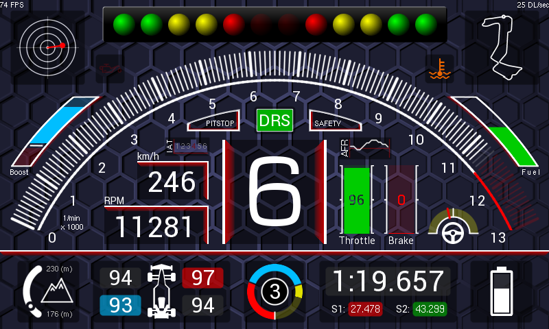
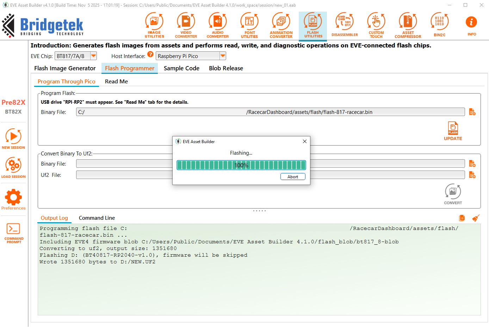
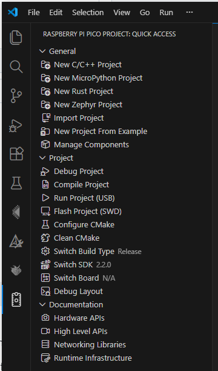

# EVE-MCU-Dev Race Car Dashboard Example

[Back](../README.md)

## Racecar Dashboard Example

**This demo is targeted specifically for the [IDM2040-7A](https://brtchip.com/product/idm2040-7a/) develoepment module.**

The `racecar dashboard` example demonstrates drawing a multi-function dashboard for a racing car.

A racecar dashboard is drawn using bitmaps, blending, scissoring, arcs and custom fonts. The `racecar` code uses the `furman` snippet from the [snippets/maths](eve_library/examples/snippets/maths) directory to calculate angles using furman trigonometry. Furman angles are an implementation of angles using only integer values to enable this demo to run on hardware which does not support floating point values. Refer to the BridgeTek Programming Guides for the EVE device for a full explanation of this method.

The example is intended to show a reimaginged dashboard for a racecar. External inputs would provide the data for the vehicle speed, engine RPM, acceleration, braking, track position, battery charge status and gear selection. This data is precomputed and stored in arrays in the program.

Graphics assets are stored in the attached EVE device Flash. Images are conveterd and stored as ASTC compressed images.

**NOTE:** The Flash must be pre-programmed before using the example on the IDM2040-7A module using the [EVE Asset Builder](https://brtchip.com/eab/) toolchain, the `flash-817-racecar.bin` file required is located in the [/assets/flash](assets/flash) folder.

A precompiled .uf2 file to program the IDM2040-7A with the example can be found in the [/build](build) folder.

This example supports the following platforms:

| Port Name | Port Directory | Supported |
| --- | --- | --- |
| Raspberry Pi Pico | pico | Yes |

Supported EVE APIs in this example:

| EVE API 1 | EVE API 2 | EVE API 3 | EVE API 4 | EVE API 5 |
| --- | --- | --- | --- | --- |
| No | No | No | Yes | No |

The following is an screenshot of the racecar example:



### `main.c`

The application starts up in the file `main.c` which provides initial MCU configuration and then calls `eve_example.c` where the remainder of the application will be carried out. 

The `main.c` code is platform specific. It must provide any functions that rely on a platform's operating system, or built-in non-volatile storage mechanism. 
The example program in the example code is then called.

### `eve_example.c`

In the function `eve_example` the basic format is as follows:

```
void eve_example(void)
{
    EVE_Init();                 // Initialise the display

    flash_full_speed();         // Ensure flash can enter Full speed

    set_asset_props();          // Configure asset properties for custom assets used in application

    eve_display_load_assets();  // Load assets into RAM_G

    eve_display();              // Run Application
 }
```

The call to `EVE_Init()` is made which sets up the EVE environment on the platform. This will initialise the SPI communications to the EVE device and set-up the device ready to receive communication from the host.

The `flash_full_speed()` funciton is called to ensure that any attached flash IC can successfully enter FULL speed mode (this requires the .blob driver file to be present on the flash).

Following this the `set_asset_props()` function is called to configure specific properties for each asset (size, height, witdth, format, etc), which are then used in the `eve_display_load_assets()` funciton to load the assets into RAM_G fo use in the applciation.

Once the precceeding steps are complete, the main loop is called which sits in a continuous loop within `eve_display()`. Each time round the loop, a screen is created using a co-processor list. 

## Files and Folders

The example contains a common directory with several files which comprise all the demo functionality.

| File/Folder | Description |
| --- | --- |
| [example/eve_example.c](common/eve_example.c) | Example source code file |
| [docs](docs) | Documentation support files |
| [eve_library](eve_library) | Copy of relevant [EVE-MCU-dev](https://github.com/Bridgetek/Eve-MCU-Dev/tree/main) library files for example |
| [assets](assets) | Directory for asset conversions and flash binary used in example |
| [assets/flash](assets/flash) | Directory for storage of generated flash binary files |
| [assets/fonts](assets/fonts) | Directory for storage of converted fonts |
| [assets/images](assets/images) | Directory for storage of converted images |
| [assets/source](assets/source) | Directory for storage of source PNG files |

## Build and Run

#### For IDM2040-7A:

##### Program on-board flash

   * Connect IDM2040-7A to PC via USB cable
   * Launch EVE Asset Builder and navitage to the `Flash Utilites' tab
   * Navigate to the `Flash Programmer' tab, and configure BT817/7A/8 & Raspberry Pi Pico host
   * Program [`flash-817-racecar.bin`](assets/flash) to the IDM2040-7A




##### Prepare environment

   * Install VScode
   * Install VScode extensions: Cmake, Raspberry Pi Pico extension
        
##### Build steps

   * Open VSCode
        + Open the Command Palette (Ctrl+Shift+P) and run Raspberry Pi Pico: Import Pico Project
        + Location: Select the path to the `RacecarDashboard` folder
        + Pico SDK: v2.2.0
        + Leave 'Debugger' and 'CMake' options at default settings
   * In the Raspberry Pi Pico Project: Quick Acess tab
        + Select 'Configure CMake' (wait for configuration to complete)
        + Select 'Compile Project'
          

    
   * A new binary file [build/RacecarDashboard.uf2](build) will be generated
   * Connect IDM2040-7A and EVE to PC. If needed, use Zadig to install driver "WinUSB" for the pico's USB port
   * Open USB mode on IDM2040-7A by pressing "BOOTSEL" while powering the Pico board
   * Copy the `build/RacecarDashboard.uf2` into IDM2040-7A's USB folder (RPI-RP2)
   * The demo will start ruinning

## Future Improvements

Recommended future improvments to this demo include:

   * Including support to program `flash-817-racecar.bin` to on-board flash via application code
        + Prerequisites: fatFS support library
